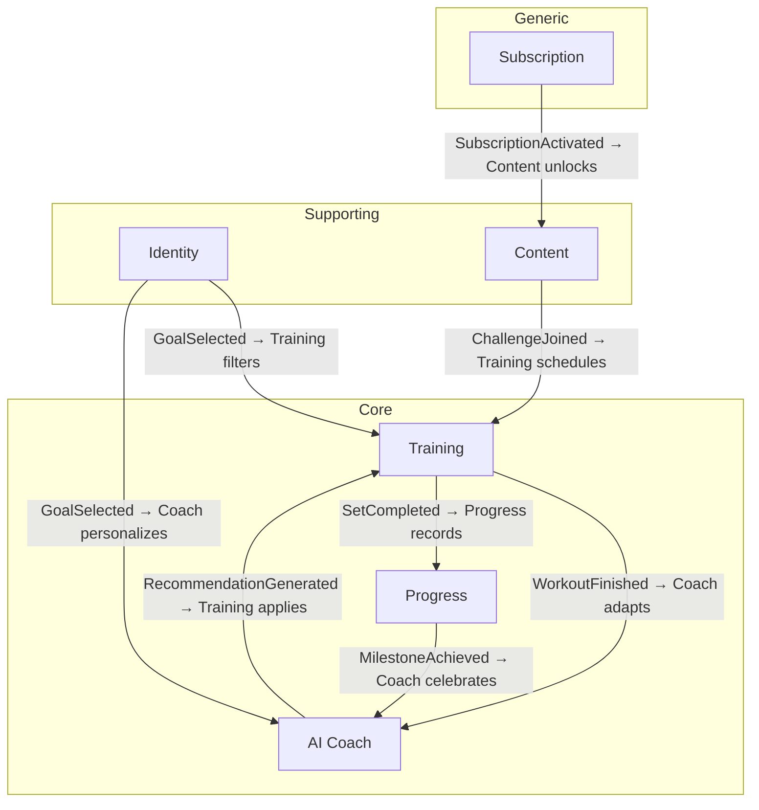

# Evara Domain Model Reference

Authoritative reference for all bounded contexts, entities, value objects, aggregates, domain events, and context integrations.

---

## Context Map

### Integration Patterns

| Upstream → Downstream | Pattern | Mechanism |
|:-----------------------|:--------|:----------|
| Training → AI Coach | Domain Events | `WorkoutFinished` triggers adaptation |
| Training → Progress | Domain Events | `SetCompleted` records strength data |
| AI Coach → Training | Published Language | `Recommendation` value object shared |
| Progress → AI Coach | Domain Events | `MilestoneAchieved` triggers coaching |
| Identity → Training, Coach | Conformist | Training/Coach conform to Identity's `FitnessGoal` |
| Content → Training | Shared Kernel | `Program` structure shared |
| Subscription → Content | Anti-Corruption Layer | Access control mapped via ACL |

---

## Training Context (Core)

### Entities

#### Program
The top-level training plan a user follows.

| Field | Type | Notes |
|:------|:-----|:------|
| `id` | `ProgramId` | Unique identifier |
| `name` | `string` | "30 Day Booty Challenge" |
| `description` | `string` | Program overview |
| `workouts` | `Workout[]` | Ordered workout sequence |
| `duration` | `Duration` | Total duration in weeks |
| `difficulty` | `Difficulty` | Beginner / Intermediate / Advanced |
| `equipment` | `EquipmentRequirement` | Gym / Home / Both |
| `targetMuscles` | `MuscleGroup[]` | Primary muscle focus |

#### Workout
A single day's training session within a program.

| Field | Type | Notes |
|:------|:-----|:------|
| `id` | `WorkoutId` | Unique identifier |
| `programId` | `ProgramId` | Parent program |
| `dayNumber` | `number` | Day within program |
| `name` | `string` | "Day 12 – Booty Program" |
| `exercises` | `Exercise[]` | Ordered exercise list |
| `estimatedDuration` | `Duration` | e.g., 45 minutes |

#### Exercise
A specific movement within a workout.

| Field | Type | Notes |
|:------|:-----|:------|
| `id` | `ExerciseId` | Unique identifier |
| `name` | `string` | "Dumbbell RDLs" |
| `targetMuscles` | `MuscleGroup[]` | "Glutes & Hamstrings" |
| `sets` | `ExerciseSet[]` | Planned sets |
| `videoUrl` | `string?` | Form demo video |
| `instructions` | `string` | AI-generated form cues |

### Value Objects

| Name | Fields | Description |
|:-----|:-------|:------------|
| `ExerciseSet` | `reps: number, weight: Weight?, restSeconds: number` | One set prescription |
| `MuscleGroup` | `name: 'glutes' \| 'hamstrings' \| 'quads' \| 'core' \| ...` | Target muscle |
| `Duration` | `minutes: number` | Time period |
| `Difficulty` | `level: 'beginner' \| 'intermediate' \| 'advanced'` | Program difficulty |
| `Weight` | `value: number, unit: 'kg' \| 'lbs'` | Weight measurement |
| `Intensity` | `rpe: number` | Rate of perceived exertion (1–10) |
| `EquipmentRequirement` | `type: 'gym' \| 'home' \| 'both'` | Equipment needed |

### Aggregate: WorkoutSession

The active workout being performed. **Aggregate root.**

| Field | Type | Notes |
|:------|:-----|:------|
| `id` | `SessionId` | Unique identifier |
| `workoutId` | `WorkoutId` | Which workout |
| `userId` | `UserId` | Who is training |
| `startedAt` | `Date` | Session start |
| `completedAt` | `Date?` | Session end (null = in progress) |
| `completedSets` | `CompletedSet[]` | Actual performance |
| `currentExerciseIndex` | `number` | Active exercise |
| `restTimerSeconds` | `number?` | Current rest countdown |

**Invariants:**
- Cannot complete a set for an exercise not in the workout
- Reps and weight must be > 0 when completing a set
- Session cannot be completed until all required sets are done
- Rest timer cannot be negative

### Domain Events

| Event | Payload | Triggered When |
|:------|:--------|:---------------|
| `WorkoutSessionStarted` | `{ sessionId, workoutId, userId, startedAt }` | User taps "Start Workout" |
| `SetCompleted` | `{ sessionId, exerciseId, setNumber, reps, weight }` | User completes a set |
| `RestTimerStarted` | `{ sessionId, durationSeconds }` | Auto-start after set |
| `WorkoutFinished` | `{ sessionId, totalSets, totalVolume, duration }` | All sets done |

---

## AI Coach Context (Core)

### Entities

#### Recommendation
An AI-generated suggestion for the user.

| Field | Type | Notes |
|:------|:-----|:------|
| `id` | `RecommendationId` | Unique identifier |
| `userId` | `UserId` | Target user |
| `type` | `'weight' \| 'volume' \| 'rest' \| 'deload'` | Recommendation type |
| `message` | `string` | Natural language coaching |
| `suggestedValue` | `number?` | e.g., suggested weight |
| `confidence` | `number` | 0–1 confidence score |
| `generatedAt` | `Date` | Timestamp |

#### FatigueAssessment
AI analysis of user's energy and recovery state.

| Field | Type | Notes |
|:------|:-----|:------|
| `userId` | `UserId` | Target user |
| `energyLevel` | `EnergyLevel` | Low / Medium / High |
| `suggestedAction` | `'proceed' \| 'reduce' \| 'deload' \| 'rest'` | Recommended action |
| `rationale` | `string` | AI reasoning |

### Value Objects

| Name | Fields | Description |
|:-----|:-------|:------------|
| `EnergyLevel` | `level: 'low' \| 'medium' \| 'high'` | Perceived energy |
| `CoachingTone` | `tone: 'motivating' \| 'gentle' \| 'celebratory' \| 'analytical'` | Persona voice |
| `ProgressionRule` | `metric: string, threshold: number, action: string` | When to increase load |

### Domain Events

| Event | Payload |
|:------|:--------|
| `RecommendationGenerated` | `{ userId, recommendation }` |
| `FatigueDetected` | `{ userId, assessment }` |
| `CoachMessageSent` | `{ userId, message, tone }` |

---

## Progress Context (Core)

### Entities

#### ProgressPhoto
A user's body photo for visual tracking.

| Field | Type | Notes |
|:------|:-----|:------|
| `id` | `PhotoId` | Unique identifier |
| `userId` | `UserId` | Owner |
| `imageUri` | `string` | Local/cloud URI |
| `takenAt` | `Date` | Capture date |
| `week` | `number` | Week number in journey |
| `bodyPart` | `'front' \| 'side' \| 'back'` | Angle |

#### StrengthRecord
A personal best or tracked lift.

| Field | Type | Notes |
|:------|:-----|:------|
| `id` | `RecordId` | Unique identifier |
| `userId` | `UserId` | Owner |
| `exerciseName` | `string` | "Deadlift" |
| `weight` | `Weight` | PR weight |
| `reps` | `number` | Reps at PR |
| `achievedAt` | `Date` | When achieved |
| `previousBest` | `Weight?` | For "+5kg jump" display |

### Aggregate: ProgressTimeline

User's entire progress history. **Aggregate root.**

**Invariants:**
- Photos must have a valid week number (>= 1)
- Strength records cannot have weight <= 0
- Milestones are automatically generated when criteria are met

### Value Objects

| Name | Fields | Description |
|:-----|:-------|:------------|
| `BodyMeasurement` | `glutes: number, unit: 'cm' \| 'in', measuredAt: Date` | Circumference |
| `PersonalBest` | `exerciseName: string, weight: Weight, improvement: Weight` | PR with delta |
| `Milestone` | `type: 'streak' \| 'pr' \| 'visual' \| 'consistency', label: string` | Achievement |

### Domain Events

| Event | Payload |
|:------|:--------|
| `ProgressPhotoAdded` | `{ userId, photoId, week }` |
| `PersonalBestSet` | `{ userId, exerciseName, newWeight, previousWeight }` |
| `MilestoneAchieved` | `{ userId, milestone }` |
| `StreakExtended` | `{ userId, dayCount }` |

---

## Identity Context (Supporting)

### Entities

#### UserProfile
| Field | Type | Notes |
|:------|:-----|:------|
| `id` | `UserId` | Unique identifier |
| `name` | `string` | Display name |
| `avatarUri` | `string?` | Profile photo |
| `memberSince` | `Date` | Registration date |
| `fitnessGoal` | `FitnessGoal` | Selected goal |
| `onboardingState` | `OnboardingState` | Completion status |

### Value Objects

| Name | Fields | Description |
|:-----|:-------|:------------|
| `FitnessGoal` | `type: 'grow_glutes' \| 'tone_body' \| 'full_body_sculpt'` | Primary focus |
| `OnboardingState` | `currentStep: number, totalSteps: number, completed: boolean` | Wizard state |
| `Streak` | `currentDays: number, longestDays: number, lastWorkoutDate: Date` | Consistency |

### Domain Events

| Event | Payload |
|:------|:--------|
| `GoalSelected` | `{ userId, goal }` |
| `OnboardingCompleted` | `{ userId, selectedGoal, preferences }` |
| `ProfileUpdated` | `{ userId, changes }` |

---

## Content Context (Supporting)

### Entities

| Entity | Key Fields |
|:-------|:-----------|
| `GuidedProgram` | `id, name, description, lessons[], difficulty, isPremium` |
| `VideoLesson` | `id, programId, title, videoUrl, duration, instructor` |
| `Challenge` | `id, name, durationDays, description, startDate, participants[]` |

### Domain Events

| Event | Payload |
|:------|:--------|
| `ChallengeJoined` | `{ userId, challengeId }` |
| `LessonCompleted` | `{ userId, lessonId }` |

---

## Subscription Context (Generic)

### Entities

| Entity | Key Fields |
|:-------|:-----------|
| `Subscription` | `id, userId, plan, status, startDate, expiresAt` |
| `Plan` | `id, name, tier, priceMonthly, features[]` |

### Value Objects

| Name | Fields |
|:-----|:-------|
| `SubscriptionTier` | `tier: 'free' \| 'premium'` |

### Domain Events

| Event | Payload |
|:------|:--------|
| `SubscriptionActivated` | `{ userId, planId, tier }` |
| `SubscriptionExpired` | `{ userId, planId }` |
